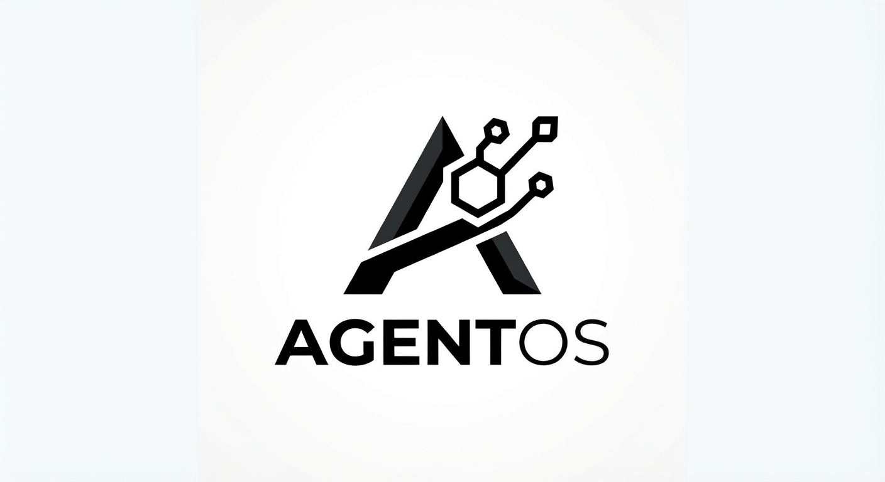
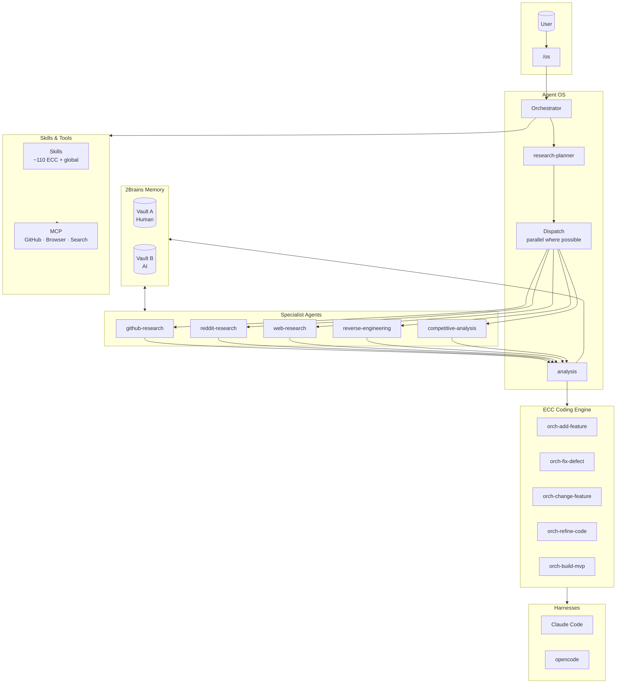
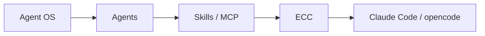

<h1>AgentOS</h1>

A layered **Agent Operating System** where **ECC** is the coding engine — a whole ecosystem of specialist agents orchestrated over shared memory, sitting on top of the existing Claude Code / opencode harnesses.

**The core distinction**

|               | ECC                                                   | Agent OS                                                     |
| ------------- | ----------------------------------------------------- | ------------------------------------------------------------ |
| **Answers**   | How do I make Claude Code work **better**?            | How do I make a whole ecosystem of agents work **together**? |
| **Scope**     | Coding agents, skills, commands, hooks, dev workflows | Orchestrator + specialist agents + shared memory             |
| **Layer**     | Engine                                                | OS sitting above the engine                                  |
| **Analogy**   | The CPU / compiler                                    | The operating system                                         |
| **Key verbs** | Code, review, test, commit                            | Route, dispatch, synthesize, remember                        |

The architecture is exactly that hierarchy:

## Docs

| Doc                                            | Covers                                     | Status      |
| ---------------------------------------------- | ------------------------------------------ | ----------- |
| [`idea.md`](idea.md)                           | Vision, principles, 2Brains memory concept | ✅           |
| [`docs/architecture.md`](docs/architecture.md) | Layered design mapped onto this machine    | ✅           |
| [`docs/agents.md`](docs/agents.md)             | Specialist agents and their specs          | ✅           |
| [`docs/memory.md`](docs/memory.md)             | 2Brains: Vault A (human) + Vault B (AI)    | ✅           |
| [`docs/workflows.md`](docs/workflows.md)       | The `/os` pipeline and ECC handoff         | ✅           |
| [`docs/installation.md`](docs/installation.md) | What is installed where + current status   | ✅           |
| [`docs/roadmap.md`](docs/roadmap.md)           | Milestones and next steps                  | In progress |

## Status

| Milestone | Name                            | State                         |
| --------- | ------------------------------- | ----------------------------- |
| M0        | Foundation                      | ✅ Done                        |
| M1        | Wire agents + orchestrator      | ✅ Done                        |
| M2        | Prove the loop (pilot)          | ✅ Done — ECC handoff unproven |
| M3        | Make it autonomous and reliable | ⏳ Next                        |
| M4        | Harden and share                | 🔜 Planned                    |

- **Done** — global agent workspace (`~/.agents/`), buildermethods tools (agent-os standards, bm-skills, agentcanon), agent/os wired into both opencode + Claude Code, 2Brains scaffold, M2 pilot run (`/os reverse engineer Apify` → verdict `answer-only`), lightpanda + archify + i18n integrated.
- **In progress** — specialist agent registration, `/os` orchestrator command, kernel routing in `AGENTS.md`.
- See [`docs/roadmap.md`](docs/roadmap.md) for the full picture.

