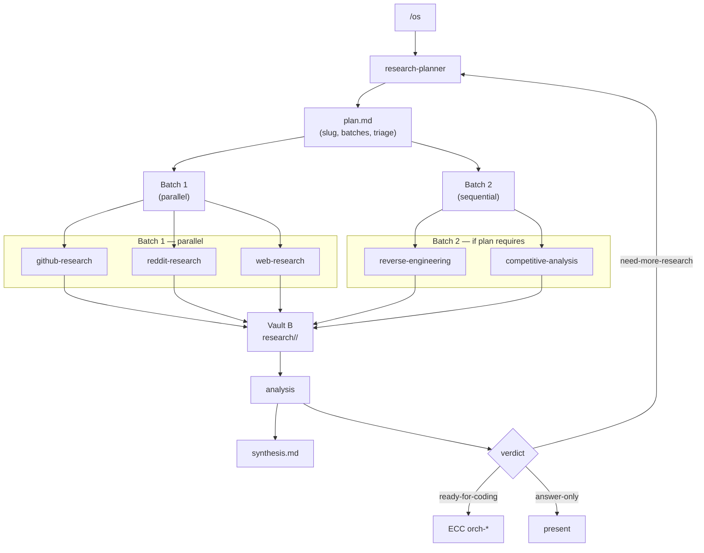
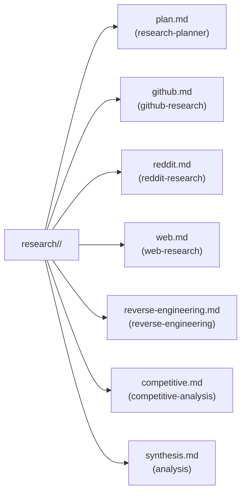

# agents.md — the specialist agents

All seven agents are defined once as canonical pure-text prompts in `~/.agents/os/prompts/<name>.md`, then surfaced in each harness:

- **opencode** — `agent` config entries referencing the canonical file (`prompt: {file:agents/<name>.md}`).
- **Claude Code** — thin wrappers in `~/.agents/os/agents/<name>.md` (YAML frontmatter + same body), exposed via `~/.claude/agents/` symlink.

## Dispatch flow

## Registry

| Agent | Role | Routes to | Trigger | Output | Parallel? |
|---|---|---|---|---|---|
| `research-planner` | Decomposes request → dispatch plan | none (orchestration) | always first in `/os` | `plan.md` | N/A — writes plan |
| `github-research` | Repos, architecture, APIs, activity, ecosystem | agent-reach (GitHub), gh CLI, repo-scan | codebase / tooling questions | `github.md` | ✅ |
| `reddit-research` | Community sentiment, adoption stories, pain points | agent-reach (Reddit), web search fallback | "what do people say/do" | `reddit.md` | ✅ |
| `web-research` | Market context, docs, standards, factual claims | web search/fetch, documentation-lookup, exa-search | anything factual | `web.md` | ✅ |
| `reverse-engineering` | Reconstruct how unknown software works | repo-scan, code-tour, git clone, build/probe | "reverse engineer X" | `reverse-engineering.md` | ⚠️ sequential |
| `competitive-analysis` | Competitor sets, scoring, white space | competitive-platform-analysis → benchmark-methodology → competitive-report-structure | "compare X vs Y" | `competitive.md` | ⚠️ sequential |
| `analysis` | Synthesis: merge findings, resolve conflicts, verdict | reads all vault notes | always last, before routing | `synthesis.md` | N/A — reads all |

## Shared conventions (all agents)

1. **Plan first** — read `~/.agents/os/memory/ai/research/<slug>/plan.md` before doing anything.
2. **Receipts** — every claim carries a source (link, file:line, thread) and a confidence rating **A/B/C** (primary / reliable / secondary).
3. **Conclusion-first output** — each note opens with a ≤5-line summary.
4. **Vault discipline** — write only to your assigned files under `~/.agents/os/memory/ai/research/<slug>/`; append (never overwrite) session lines to `~/.agents/os/memory/ai/logs/<date>-<agent>.md`.
5. **No scope-creep** — researchers gather evidence, `analysis` concludes, ECC codes.

## File layout per research run

| File | Author | Required? |
|---|---|---|
| `plan.md` | research-planner | ✅ always |
| `github.md` | github-research | if codebase/tooling question |
| `reddit.md` | reddit-research | if community signal needed |
| `web.md` | web-research | ✅ always (unless superseded by github) |
| `reverse-engineering.md` | reverse-engineering | if task says "reverse engineer X" |
| `competitive.md` | competitive-analysis | if task says "compare X vs Y" |
| `synthesis.md` | analysis | ✅ always |

## Agent specs (condensed)

### research-planner
Reads the task, picks channels by question type, writes `plan.md`, returns `{slug, agents, parallel batches, triage_order, key_unknowns}` to the orchestrator. States assumptions when intent is ambiguous. Never researches or codes itself.

### github-research
Answers GitHub-centric questions with primary sources (repo, releases, issue tracker). Output `github.md`: Summary → Q&A (with evidence + confidence) → Signals (activity, maintenance, adoption, security) → Unresolved.

### reddit-research
Extracts quoted claims tagged `{subreddit, thread link, date, credibility}`. Output `reddit.md`: Summary → Claims → Sentiment → Contrarian views → Unresolved. Hard rule: if the Reddit backend is unavailable, say so — never fabricate threads.

### web-research
Prefer primary sources (vendor docs, standards bodies, papers). Output `web.md`: Summary → Q&A (source URL + date + confidence) → Market/factual notes → Unresolved. "A claim without a URL is an unresolved item."

### reverse-engineering
Maps unknown systems: shape → entry points → flows → surface. Output `reverse-engineering.md`: Summary → Architecture map → Entry points + key flows (file:line) → External surface → Open questions. Descriptive only — no modification, hacks, or monetization.

### competitive-analysis
Runs the three-skill ECC pipeline in order. Output `competitive.md`: Landscape summary → Tier table → Scoring matrix (1–5 rubric, weighted, tension-plot) → White space → Sources. Every score is evidence-backed; inferred marks flagged.

### analysis
Reads the whole `research/<slug>/` folder, reconciles across agents, weights by confidence. Output `synthesis.md`: Bottom line → Findings by question → Conflicts resolved → Open questions → Implications. Returns a verdict string to the orchestrator: `ready-for-coding` | `need-more-research` | `answer-only`.
