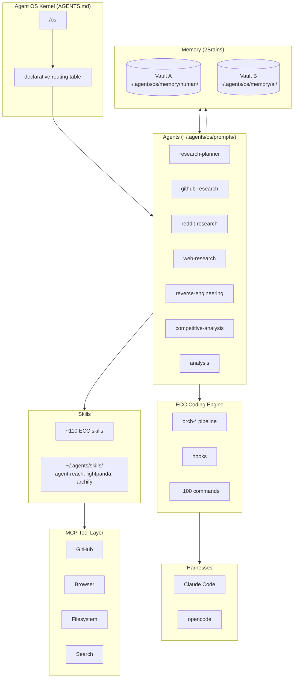
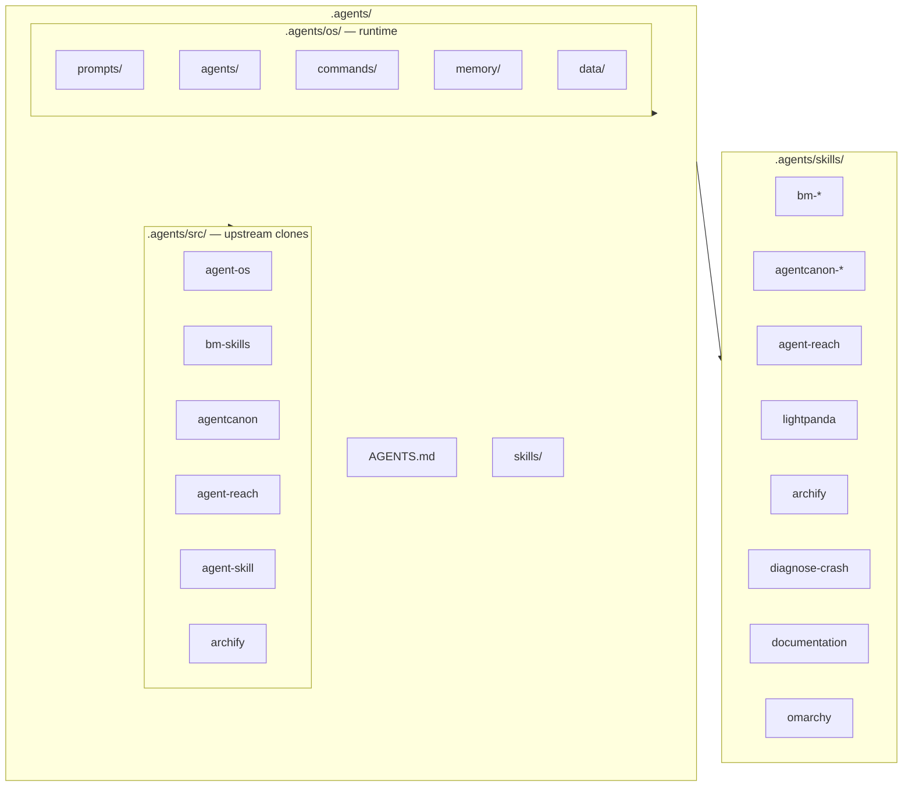
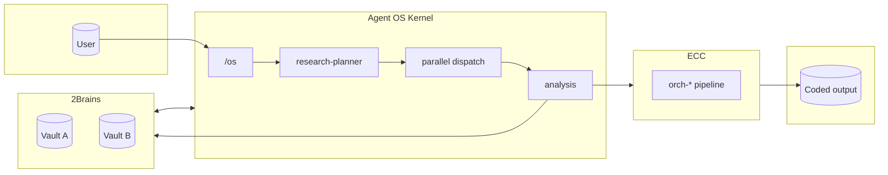

# architecture.md — the layered design on this machine

## Stack

## Layer map: vision vs. what exists

| Layer | In the vision | On this machine | Status |
|---|---|---|---|
| ECC / coding engine | Coding agents, skills, commands, hooks, dev workflows | Live in both harnesses; ~110 skills, ~100 commands, 30 agents, `orch-*` pipeline | ✅ Done |
| MCP (tool layer) | GitHub, Browser, Filesystem, Database, Search | ECC MCP + agent-reach (15 platforms, zero-config channels) + orca session layer | ✅ Done |
| Skills (capabilities) | One skill = one job | agent-reach, github-ops, deep-research, exa-search, repo-scan, competitive-* pipeline, documentation-lookup, lightpanda, archify | ✅ Reuse, do not duplicate |
| Specialist agents | github/reddit/web research, reverse-engineering, competitive analysis | 7 agent prompts authored (`~/.agents/os/prompts/`); wired into opencode via `{file:agents/<name>.md}` and Claude Code via wrappers | ✅ Done |
| Orchestrator / kernel | COO that routes tasks across specialists | `/os` command + routing table in `AGENTS.md`; per-task orchestration also available (`plan-orchestrate`, `ralphinho`, `orch-*`) | ✅ Done |
| Memory / 2Brains | Vault A human + Vault B AI underneath everything | Scaffold + conventions + data dirs (`logs/`, `decisions/`, `projects/`, `inbox/`) | ✅ Done |

## Naming note (avoid confusion)

| Name | What it is | Where |
|---|---|---|
| **`agent-os`** (lowercase, buildermethods) | The *standards system* (`/discover-standards`, `/inject-standards`, …) | `~/.agents/src/agent-os/` |
| **Agent OS** (capitalized) | The whole *operating system for agents* described here | Runtime at `~/.agents/os/` |
| **ECC** | The coding engine (skills, commands, hooks, agents, `orch-*` pipeline) | `~/.config/orca/opencode-hooks/shared/` |

## Global layout (`~/.agents/`)

| Dir | Purpose |
|---|---|
| `AGENTS.md` | Workspace doc + Agent OS kernel (routing, conventions) |
| `skills/` | Canonical global skills (symlinks into `src/` clones) |
| `src/` | Persistent upstream clones — `git pull` to update |
| `os/prompts/` | Canonical pure-text agent prompts (opencode `{file:}` source) |
| `os/agents/` | Claude Code agent wrappers (frontmatter + body) |
| `os/commands/` | `/os` + agent-os standards commands |
| `os/memory/human/` | Vault A — human-authored knowledge |
| `os/memory/ai/` | Vault B — agent-produced research, logs, reflections |
| `os/data/logs/` | Append-only session logs |
| `os/data/decisions/` | Decision records (ADR-lite) |
| `os/data/projects/` | Per-project context files |
| `os/data/inbox/` | Tasks and ideas awaiting triage |

## How the layers connect

| Layer | Role | Key files |
|---|---|---|
| **Kernel** (`AGENTS.md`) | Declarative routing: user intent → specialist agent → skill → ECC handoff | `AGENTS.md` |
| **Agents** (`os/prompts/`) | Thin prompt files naming skills + declaring memory scope | `~/.agents/os/prompts/<name>.md` |
| **Skills** | Reused from ECC (~110) + `~/.agents/skills/`; never re-implement what a skill covers | `~/.agents/skills/`, `~/.config/orca/opencode-hooks/shared/skills/` |
| **MCP** | Scoped tool surface agents call through; integrations stay out of agent prompts | `shared/opencode.json` `mcp` block |
| **Memory (2Brains)** | Read-before-start / append-after-finish for every agent | `~/.agents/os/memory/{human,ai}/` |
| **ECC** | Coding engine receives routed work through `orch-*` pipeline | `shared/skills/orch-*/` |

**ECC handoff entry points:**

| Task type | ECC entry point |
|---|---|
| New capability | `orch-add-feature` |
| Fix a bug | `orch-fix-defect` |
| Change existing behavior | `orch-change-feature` |
| Refactor, same behavior | `orch-refine-code` |
| From a spec to a running MVP | `orch-build-mvp` |

Each chains: research → plan → TDD → review → gated commit.
