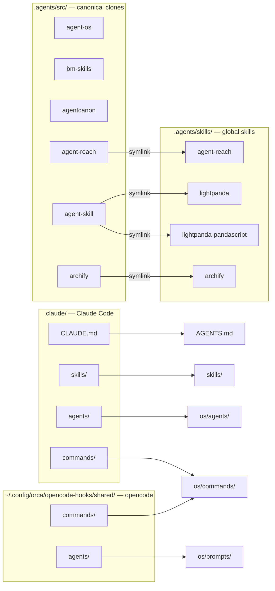

# installation.md — what is installed, where, and current status

## Prerequisites on this machine

| Tool | Version / path | Role |
|---|---|---|
| **opencode** | active via `OPENCODE_CONFIG_DIR=/home/darko/.config/orca/opencode-hooks/shared` | Primary harness (ECC config via orca shim) |
| **Claude Code** | reads `~/.claude/` | Secondary harness |
| **orca** | session/shim layer | Injects env vars, runs hooks |
| **ECC** | `~/.config/orca/opencode-hooks/shared/` | Skills, commands, agents, hooks, plugin |
| **Node.js** | v26.7.0 (mise) | Runs archify CLI + skill tooling |
| **Zig** | not installed | Not required — lightpanda uses prebuilt nightly binary |

## Canonical workspace (`~/.agents/`)

| Path | What |
|---|---|
| `~/.agents/AGENTS.md` | Workspace doc + Agent OS kernel (loaded by both harnesses) |
| `~/.agents/skills/` | Global skills: bm-* (4), agentcanon-* (2), agent-reach, lightpanda (+ pandascript), archify, diagnose-crash, documentation, learned, omarchy |
| `~/.agents/src/agent-os` | buildermethods agent-os clone (standards system) |
| `~/.agents/src/bm-skills` | buildermethods bm-skills clone |
| `~/.agents/src/agentcanon` | buildermethods agentcanon clone |
| `~/.agents/src/agent-reach` | Panniantong/agent-reach clone (internet capability router) |
| `~/.agents/src/agent-skill` | lightpanda-io/agent-skill clone (headless browser for AI agents) |
| `~/.agents/src/archify` | tt-a1i/archify clone (interactive system diagrams) |
| `~/.agents/os/` | Agent OS runtime: prompts (7), memory (human/ai), data (logs, decisions, projects, inbox) |
| `~/Projects/buildermethods/{design-os, build-new}` | App templates |
| `~/Projects/AgentOS/` | This project's documentation |

## Symlink wiring (agentcanon: symlinks, never copies)



| Symlink | → Target | Purpose |
|---|---|---|
| `~/.claude/CLAUDE.md` | `~/.agents/AGENTS.md` | Claude Code loads workspace doc |
| `~/.claude/skills` | `~/.agents/skills` | Shared global skills |
| `~/.agents/skills/agent-reach` | `~/.agents/src/agent-reach/agent_reach/skill` | agent-reach skill (canonical clone home) |
| `~/.agents/skills/lightpanda` | `~/.agents/src/agent-skill` | lightpanda skill (headless browser) |
| `~/.agents/skills/lightpanda-pandascript` | `~/.agents/src/agent-skill/pandascript` | pandascript sub-skill (deterministic replay) |
| `~/.agents/skills/archify` | `~/.agents/src/archify/archify` | archify skill (interactive system diagrams) |
| `~/.claude/commands/agent-os` | `~/.agents/src/agent-os/commands/agent-os` | agent-os standards commands (Claude Code) |
| `~/.config/orca/opencode-hooks/shared/commands/agent-os` | `~/.agents/src/agent-os/commands/agent-os` | agent-os standards commands (opencode) |
| `~/.claude/agents` | `~/.agents/os/agents` | Specialist agent wrappers (Claude Code) |
| `~/.claude/commands/os.md` | `~/.agents/os/commands/os.md` | `/os` command (Claude Code) |
| `~/.config/orca/opencode-hooks/shared/commands/os.md` | `~/.agents/os/commands/os.md` | `/os` command (opencode) |
| `~/.config/orca/opencode-hooks/shared/agents` | `~/.agents/os/prompts` | Canonical agent prompts (opencode `{file:}`) |

## Tool binaries

| Binary | Install method | Version | Role |
|---|---|---|---|
| `agent-reach` | uv tool (`~/.local/share/uv/tools/agent-reach/`) | v1.5.0 | Internet capability router (15 platforms) |
| `lightpanda` | `scripts/install.sh` → `~/.local/bin/` | nightly.9268 | Headless browser for AI agents |
| `rdt-cli` | `pipx install git+...@5e4fb37` | v0.4.2 | Reddit backend for agent-reach |

## opencode config additions (`shared/opencode.json`)

| Section | Content |
|---|---|
| `mcp` | `lightpanda` — local command `lightpanda mcp` |
| `agent` | 7 specialist agents (`research-planner`, `github-research`, `reddit-research`, `web-research`, `reverse-engineering`, `competitive-analysis`, `analysis`) |
| `command` | `discover-standards`, `index-standards`, `inject-standards`, `plan-product`, `shape-spec`, `os` |
| `instructions` | `AGENTS.md` appended so the Agent OS kernel is loaded |

## Status

### Done
- [x] Global workspace `~/.agents/` (agentcanon layout + AGENTS.md + symlinks)
- [x] buildermethods tools installed and wired into both harnesses
- [x] agent-os standards commands working in opencode + Claude Code
- [x] 7 specialist agent **prompts** authored (`~/.agents/os/prompts/`)
- [x] 2Brains scaffold + data dirs created
- [x] 7 agents registered in `shared/opencode.json` (`agent` entries → `{file:agents/<name>.md}`)
- [x] Claude Code agent wrappers (`~/.agents/os/agents/*.md`) + `~/.claude/agents` symlink
- [x] `/os` orchestrator command (`~/.agents/os/commands/os.md`) + registered in both harnesses
- [x] Agent OS routing table + 2Brains conventions added to `AGENTS.md` kernel
- [x] Config JSON + symlinks validated
- [x] Reddit channel unblocked for the pilot: `rdt-cli` v0.4.2 (pinned git) installed, Brave Reddit cookies saved to `~/.config/rdt-cli/credential.json`. Note: `agent-reach doctor` still reports Reddit `warn` — its probe checks the legacy `reddit_session` cookie; modern Reddit issues `token_v2`, which rdt actually uses (see `memory/ai/logs/2026-09-08-os.md` reflection)
- [x] Lightpanda: binary installed (nightly.9268, checksum verified), skill symlinked, MCP registered in shared config
- [x] Archify: skill cloned, symlinked, CLI verified (`node bin/archify.mjs --help`)
- [x] design-os: react-i18next + i18next wired in, LanguageToggle added, chrome refactored to `t()` (en + zh)

### Pending (M2)
- [x] Restart opencode to load the new agents/commands (done — agents live in this session)
- [x] Pilot `/os` on a real research task ("reverse engineer Apify") — verdict `answer-only`
- [ ] Prove the ECC handoff on a future `ready-for-coding` task

## Updating

```bash
git -C ~/.agents/src/agent-os pull
git -C ~/.agents/src/bm-skills pull
git -C ~/.agents/src/agentcanon pull
git -C ~/.agents/src/agent-reach pull
git -C ~/.agents/src/agent-skill pull
git -C ~/.agents/src/archify pull
```

Skills/commands are symlinked from these clones — one canonical home. After any change, **restart opencode** (config loads once at startup).

## Updating binaries

| Binary | Update command |
|---|---|
| `agent-reach` | `uv tool upgrade agent-reach` |
| `lightpanda` | Re-run `bash ~/.agents/src/agent-skill/scripts/install.sh` (downloads latest nightly, verifies SHA256) |
| `rdt-cli` | `pipx upgrade rdt-cli` |

## Editing caveat

`shared/opencode.json` is ECC's config; an ECC update may regenerate or clobber it. Keep the canonical agent prompts in `~/.agents/os/prompts/` so re-adding the `agent` entries is a one-line-per-agent reapply.
