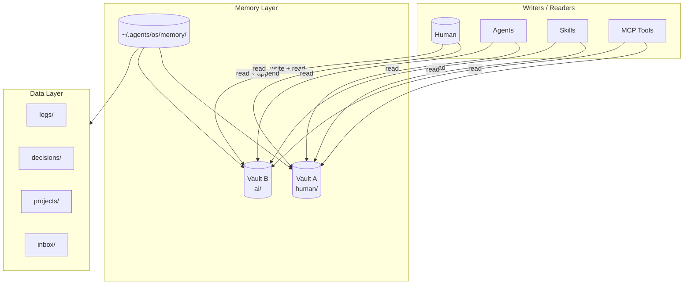
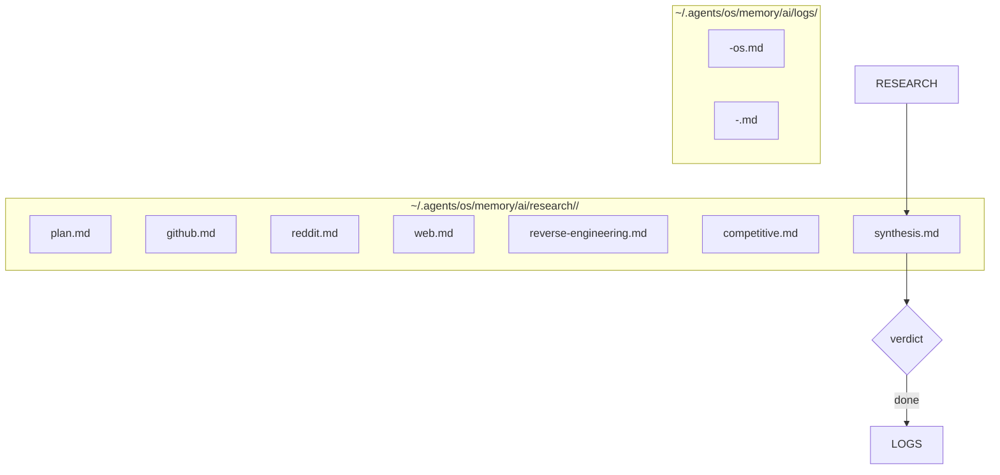

# memory.md — 2Brains

Two vaults. One rule: **human thoughts and agent thoughts never share a file.**

| Vault | Who writes | Who reads | Contains |
|---|---|---|---|
| **Vault A (Human)** | You (by hand or by telling the agent) | You + agents | Preferences, goals, decisions, feedback, "never do X" |
| **Vault B (AI)** | Agents (append-only) | Agents + you | Research notes, analyses, session logs, reflections |

## Vault A: Human

Everything the machines should know *about you and your judgment*: preferences, goals, decisions you made, feedback you gave, context agents shouldn't have to ask for twice.

- Agents **read** it at session start / before a relevant task.
- Agents **never write** to it. You do — either by hand or by telling the agent to record something *you* decided.
- Example contents: product opinions, quality bars, "never do X", contact notes, long-term goals.

## Vault B: AI

Everything agents **produce**: research notes, analyses, session logs, reflections. Agents treat it as their working memory — read before starting, append after finishing.

| File | Author | When |
|---|---|---|
| `plan.md` | research-planner | Start of every `/os` run |
| `<channel>.md` | respective research agent | After each dispatch |
| `synthesis.md` | analysis | After all channels complete |
| `logs/<date>-os.md` | orchestrator | After every `/os` run |
| `logs/<date>-<agent>.md` | respective agent | After each agent session |

## Data layer (`~/.agents/os/data/`)

Structured state alongside the vaults. File-based — no database until there's a real reason for one.

| Dir | Purpose | Append / edit rule | Example |
|---|---|---|---|
| `logs/` | Append-only session + run logs | append-only, never edit past entries | `2026-09-08-os.md` |
| `decisions/` | Decision records (ADR-lite: context → alternatives → choice → rationale) | append-only | "chose rdt-cli over PRAW" |
| `projects/` | Per-project context files agents should load | edit as project evolves | `AgentOS+ECC/context.md` |
| `inbox/` | Tasks and ideas awaiting triage | edit freely | "evaluate agent-eval for M3" |

## Conventions

- **Conclusion-first** — every note opens with the bottom line, detail below.
- **Receipts** — claims carry a source (URL, file:line, thread link) and **A/B/C confidence** (primary/reliable/secondary).
- **Append, don't overwrite** — history is asset; `logs/` is append-only.
- **Schema evolution** — never rename/delete existing fields; add new ones and mark old ones deprecated.
- **Don't repeat context** — if it's in Vault B, agents link to it instead of re-summarizing.
- **Reflect** — at the end of a run, a short reflection in `memory/ai/logs/` ("what worked / what didn't / what to change") creates a learning loop without any code changes.
- **No secrets** — memory holds notes and decisions, never keys or tokens. Secrets stay in env / secret stores.

## Why it works

- Agents that share Vault B pass context without long prompts.
- Your judgment in Vault A stays authoritative and uncontaminated by agent speculation.
- The whole system is plain files — inspectable, greppable, diffable, low-risk.
