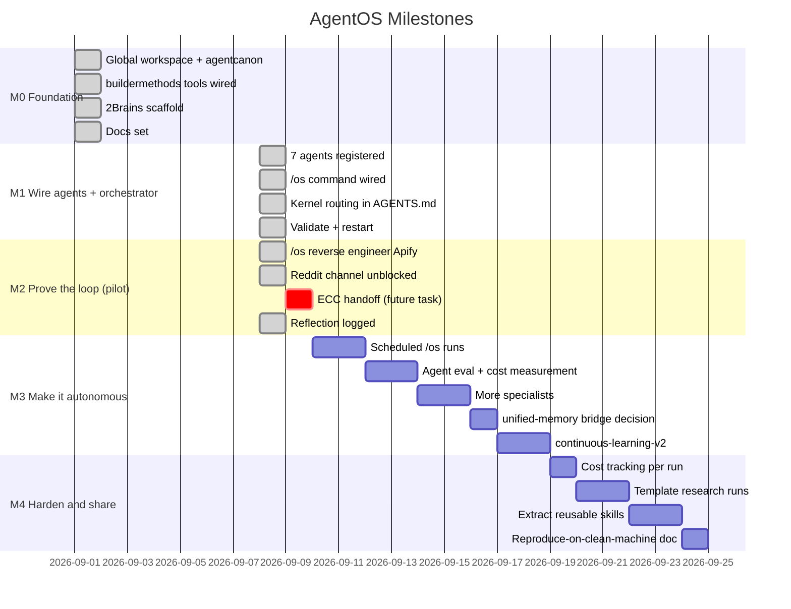

# roadmap.md — milestones and next steps

## Milestone timeline

## Progress

| Milestone | Name | Status | Notes |
|---|---|---|---|
| M0 | Foundation | ✅ Done | Global workspace, buildermethods, 2Brains, docs |
| M1 | Wire agents + orchestrator | ✅ Done | 7 agents, `/os`, kernel routing, validated |
| M2 | Prove the loop (pilot) | ✅ Done | `/os reverse engineer Apify` → `answer-only`; ECC handoff unproven |
| M3 | Make it autonomous and reliable | ⏳ Next | Scheduled runs, eval, more specialists, memory bridge |
| M4 | Harden and share | 🔜 Planned | Cost tracking, templates, extract skills, repro doc |

## M0 — Foundation ✅
- [x] Global agent workspace (`~/.agents/`) with the agentcanon convention
- [x] buildermethods ecosystem installed into both harnesses
- [x] agent-os standards commands live (`/discover-standards`, `/inject-standards`, `/index-standards`, `/plan-product`, `/shape-spec`)
- [x] 2Brains scaffold in place
- [x] This documentation set

## M1 — Wire the agents and orchestrator ✅
- [x] Register the 7 specialist agents in `shared/opencode.json` (`{file:agents/<name>.md}`)
- [x] Claude Code agent wrappers + `~/.claude/agents` symlink
- [x] Write + register `/os` command in both harnesses
- [x] Agent OS routing table + memory conventions into `AGENTS.md` kernel
- [x] Validate (JSON + symlinks) — all green
- [x] Restart opencode to load the new agents and commands (loaded in the 2026-09-08 session; agents live)

## M2 — Prove the loop with one real task (pilot) ✅
- [x] Run `/os <task>` on a real R&D task ("reverse engineer Apify")
- [x] Verify: plan → parallel dispatch → vault writes → synthesis → verdict (`answer-only`)
- [ ] Verify the ECC handoff on a coding follow-up (`orch-add-feature` / `orch-fix-defect`)

  *Not exercised: verdict was `answer-only` (research task, no coding). The ECC handoff entry point is wired in `os.md` step 4; prove it on a future task whose verdict is `ready-for-coding`.*

- [x] Check 2Brains discipline: human vault untouched, AI vault append-only, receipts present throughout
- [x] Fix whatever the pilot reveals; record the reflection in `memory/ai/logs/`
  - Full pilot log + reflection: `~/.agents/os/memory/ai/logs/2026-09-08-os.md`
  - Side-quest: unblocked the Reddit channel mid-run (rdt-cli v0.4.2 + Brave cookies) — see reflection

## M3 — Make it autonomous and reliable
- [x] Scheduled `/os` runs via an external scheduler (systemd timer / LaunchAgent / pm2) — templates in `ops/`
- [x] `agent-eval`-style pass rate + cost measurement for the new agents against ECC baselines — framework in `ops/eval/`, cost logger in `ops/cost/`
- [x] Add more specialists as recurring needs appear (scraper-builder, api-integration, market-sizing) — see `os/prompts/`
- [x] Decide usage of ECC `unified-memory` vault vs standalone 2Brains dirs — keep 2Brains, bridge later when cross-harness handoffs are proven necessary (see `docs/decisions/ADR-001-memory-strategy.md`)
- [x] Optional: `continuous-learning-v2` instincts feeding regular improvements into agent prompts — lightweight plain-file instincts in `ops/instincts/` (ECC migration path documented)

## M4 — Harden and share
- [x] Cost tracking per run (`data/logs/<date>-costs.json`) — `ops/cost/logger.sh` writes to both `ops/cost/runs/` and `os/data/logs/`
- [x] Template research runs for the most common tasks (competitor deep-dive, stack evaluation, vulnerability scope) — see `templates/research/`
- [x] Extract reusable pieces into their own skills (agentcanon-repo style) — agentos-research-templates, agentos-ops, agentos-cost, agentos-eval
- [x] Write up the pattern so it can be reproduced on a clean machine — setup.sh, CI workflow, and full documentation

## Guiding principles for every milestone
1. ECC stays the coding engine — never rewritten, always called.
2. Skills are reused before they are created.
3. Symlinks, not copies — one canonical home per artifact.
4. Memory is append-only where it records history, editable where it records plan.
5. Verify output by running it, not by declaring success.
