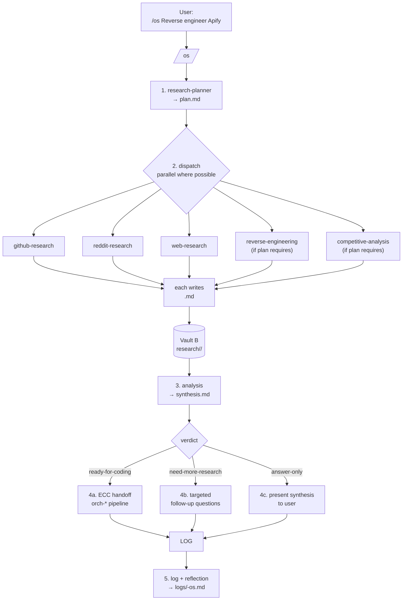
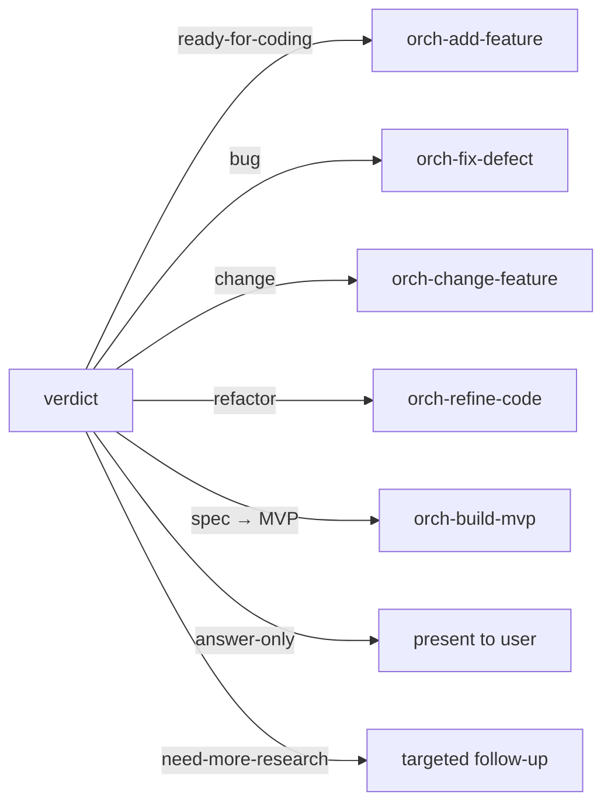

# workflows.md — the `/os` pipeline and the ECC handoff

## The orchestrator: `/os <task>`

A single user-facing command in both harnesses. It drives the whole pipeline:



## Step-by-step

### 1. Plan
The orchestrator hands the task to `research-planner`. It disambiguates scope (codebase vs industry vs competitor), depth, and audience; states assumptions; picks channels by question type; writes `plan.md`; returns the dispatch list + parallel batches + triage order.

### 2. Dispatch
The orchestrator runs the required agents as subagents — in parallel when independent. Each agent reads `plan.md`, produces only its assigned file, and reports receipts. Hard stop on any unavailable channel (e.g., no Reddit backend → recorded as unavailable, nothing invented).

### 3. Synthesize
`analysis` reads the whole slug folder, reconciles contradictions, weights by confidence, and produces `synthesis.md` plus a **verdict string**. This verdict decides the route.

### 4. Route into ECC



Coding work is handed to ECC's gated pipeline. The `orch-*` family already implements exactly that chain, so the Agent OS just picks the right entry point:

| Task type | ECC entry point | When to use |
|---|---|---|
| New capability | `orch-add-feature` | Something that doesn't exist yet |
| Fix a bug | `orch-fix-defect` | Existing behavior is broken or wrong |
| Change existing behavior | `orch-change-feature` | Behavior should be different, not broken |
| Refactor, same behavior | `orch-refine-code` | Structure should improve, behavior must not change |
| From a spec to a running MVP | `orch-build-mvp` | Turn an SDD/PRD into a running start |

Each of those runs Research → Plan → TDD → Review → gated commit, delegating each phase to the matching ECC agent (planner, tdd-guide, reviewers, build-error-resolvers).

### 5. Log
A run summary and a short reflection are appended to Vault B. This is the learning loop: next runs know what worked and what didn't.

## Scheduled / autonomous ops (future)

Per the agentic-os pattern, recurring runs can be fired by external schedulers (systemd timers on Linux, LaunchAgents on macOS, or pm2 cross-platform):

```ini
# ~/.config/systemd/user/agent-os-daily.service
[Service]
Type=oneshot
ExecStart=/usr/local/bin/opencode --cwd /home/darko/Projects --command /os <task>
```

Regular session-based cron dies when the session ends; external schedulers do not.

## Command surface (both harnesses)

| Command | Purpose | Harnesses |
|---|---|---|
| `/os <task>` | Run the full Agent OS pipeline | opencode + Claude Code |
| `/discover-standards` | Interview + extract codebase conventions into standards files | opencode + Claude Code |
| `/index-standards` | Regenerate the standards index | opencode + Claude Code |
| `/inject-standards` | Inject relevant standards into context | opencode + Claude Code |
| `/plan-product` | Plan a product using standards + product context | opencode + Claude Code |
| `/shape-spec` | Produce a spec folder before implementation | opencode + Claude Code |
| `/orch-add-feature` | New capability end to end | opencode + Claude Code |
| `/orch-fix-defect` | Reproduce → fix → review → commit | opencode + Claude Code |
| `/orch-change-feature` | Update tests → change impl → review → commit | opencode + Claude Code |
| `/orch-refine-code` | Behavior-preserving refactor | opencode + Claude Code |
| `/orch-build-mvp` | Spec → running MVP | opencode + Claude Code |
