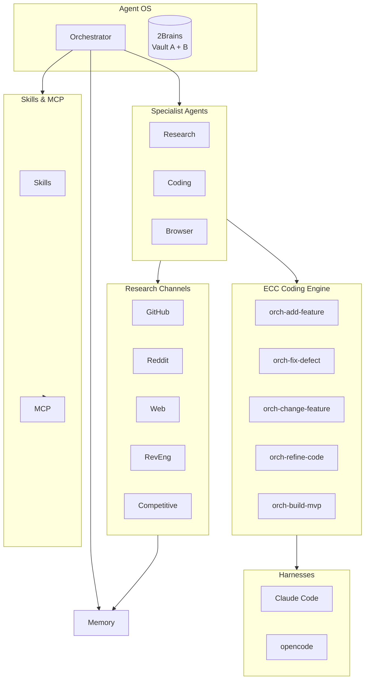
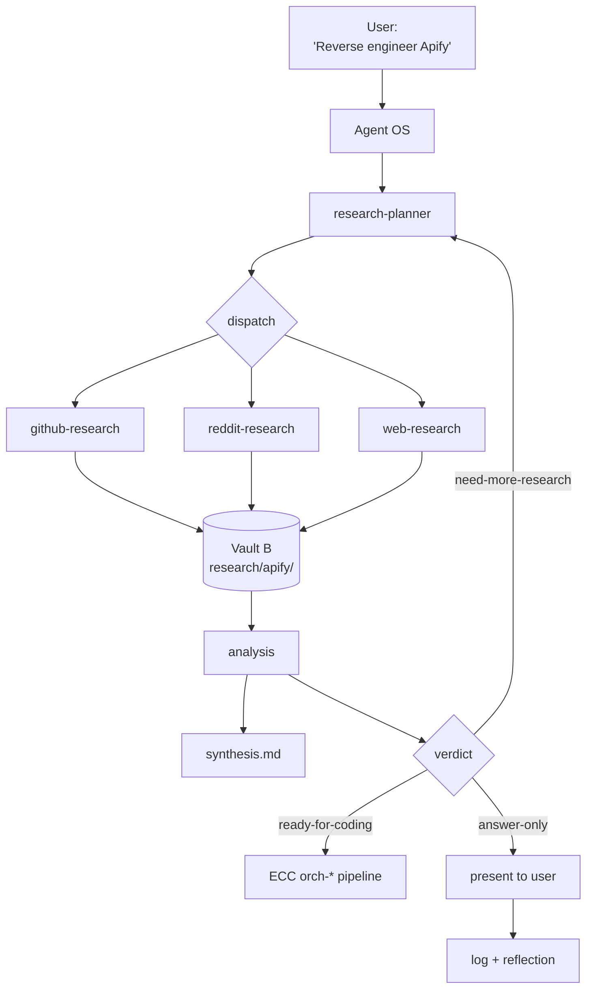
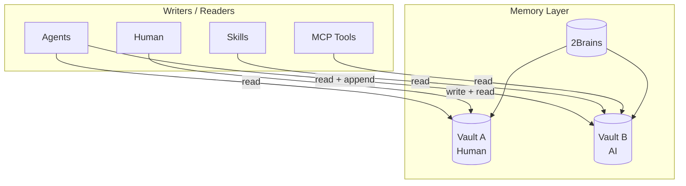
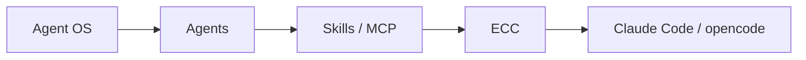

# idea.md — AgentOS: the vision

> One operating system for your agents. ECC stays the coding engine; an orchestrator lives above it; skills are capabilities; MCP is the tool layer; memory sits underneath everything.

## The problem

Right now the machine has a lot of **capability** spread across layers:

- **ECC** — ~110 skills, ~100 commands, 30 specialist agents, hooks, and an `orch-*` research → plan → TDD → review → commit pipeline.
- **buildermethods** — agent-os (standards system), bm-skills (PRD, skill-builder, design-system, favicon), agentcanon (AGENTS.md + symlink convention).
- **agent-reach / research skills** — GitHub, Reddit, web, and 15 other channels.

But these are a *pile of tools*, not a *system*. There is no single brain that decides: *"this task needs research first, from GitHub + web, then memory, then coding"*. That decision is remade by hand every session.

## The idea

Build a **layered Agent OS** — a persistent orchestrator + specialist agents + shared memory — with ECC providing the coding-agent layer underneath.

## The five rules

| # | Rule | Why |
|---|---|---|
| 1 | **ECC is the coding engine — don't rewrite it** | Use its agents, skills, commands, hooks. Agent OS *calls* ECC when coding is required. |
| 2 | **Add an orchestrator above it** | Research Planner decomposes, dispatches specialists, banks results, Analysis synthesizes, then coding starts. |
| 3 | **Skills are reusable capabilities** | One skill = one job: `github-research`, `reddit-research`, `reverse-engineering`, `competitive-analysis`. |
| 4 | **MCP is the tool layer** | Agents get scoped access to GitHub, Browser, Filesystem, Search through MCP — they don't implement integrations. |
| 5 | **Memory sits underneath everything** | Agents, skills, and MCP all read from and write to one persistent memory: **2Brains**. |

## Example run

## 2Brains memory

Memory is split into two vaults, so human-authored knowledge and AI-generated knowledge never pollute each other.

| Vault | Who writes | Who reads | Contains |
|---|---|---|---|
| **Vault A (Human)** | You (by hand or by telling the agent) | You + agents | Preferences, goals, decisions, feedback, "never do X" |
| **Vault B (AI)** | Agents (append-only) | Agents + you | Research notes, analyses, session logs, reflections |

## The important distinction

| | ECC | Agent OS |
|---|---|---|
| **Question it answers** | How do I make Claude Code work **better**? | How do I make a whole ecosystem of agents work **together**? |
| **Analogy** | The CPU / compiler | The operating system |
| **Example** | TDD, code review, build fix | Route → dispatch → synthesize → remember → code |

And the architecture is exactly that hierarchy:

